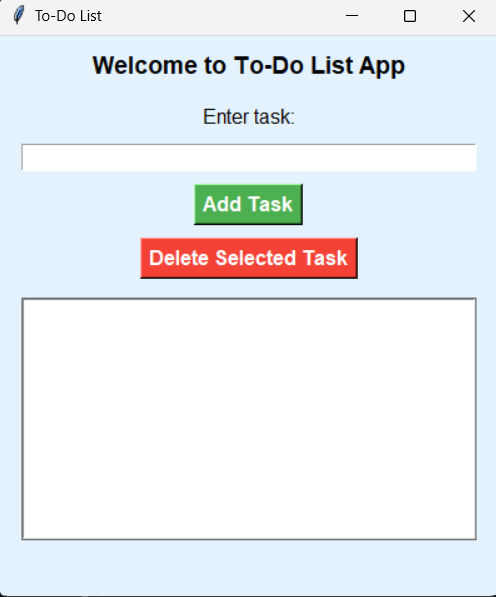
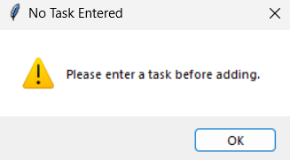
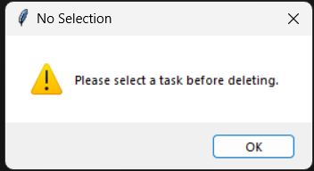
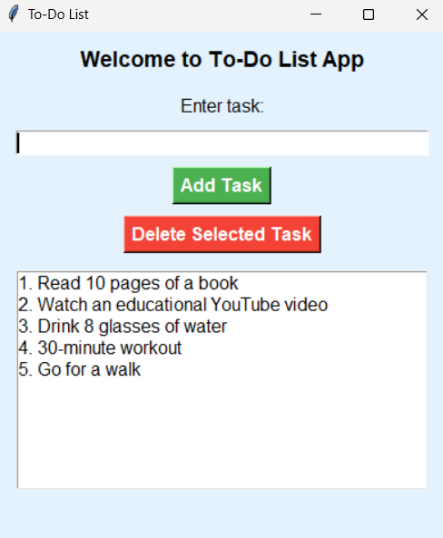

# To-Do List App

A simple GUI-based To-Do List application built using Python and Tkinter.

## Features

- Add tasks to the list
- Delete selected tasks
- Scrollable task list
- Simple and user-friendly interface

## Requirements

Ensure you have Python installed on your system. No additional libraries are required since Tkinter is built into Python.

## Installation & Usage

1. Clone this repository or download the source code:

   ```sh
   git clone https://github.com/yourusername/todo-list-tkinter.git
   cd todo-list-tkinter
   ```

2. Run the Python script:

   ```sh
   python todo_list.py
   ```

## Code Overview

The application consists of:

- **Tkinter-based GUI** for displaying and interacting with tasks
- **Listbox with scrollbar** for easy task management
- **Error handling** for empty input and unselected deletions


## Screenshots
Here is a preview of the To-Do List App:








## Contributing

Feel free to fork this repository and make improvements. If you find any bugs or have feature requests, open an issue.

## License

This project is open-source and available under the MIT License.

